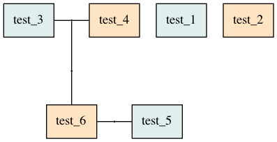

# Problem is

Not possible to have in houshold parents from bouth side.

input/i_4.txt

```
test_1 (M)
test_2 (F)
	test_5 (M, id=test_5)

# THIS FAMILY LINE WILL BE IGNORED/OVERWRITTEN
test_3 (M)
test_4 (F)
	test_6 (F, id=test_6)

(id=test_5)
(id=test_6)
```


input/i_4.txt

```
test_3 (M)
test_4 (F)
	test_6 (F, id=test_6)

# THIS FAMILY LINE WILL BE IGNORED/OVERWRITTEN
test_1 (M)
test_2 (F)
	test_5 (M, id=test_5)

(id=test_5)
(id=test_6)
```



### Output is not same, but need this feature


